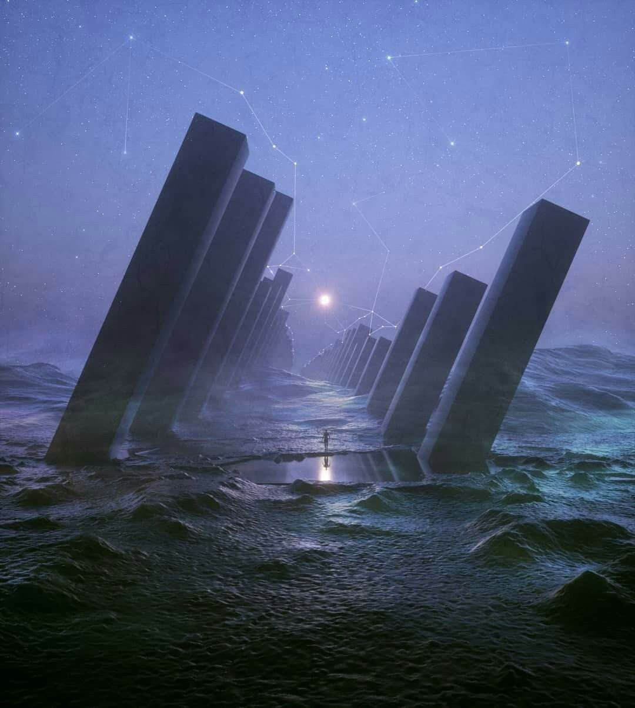

# Joyride / Starchaser

## Table of Contents

```toc
exclude: Table of Contents
```

## Description

[[Caleb Hertz]] gets access to an inter (intra?) galactic ship, and uses it to explore the galaxy. The ship needs upgrades to increase the range (as a method of limiting where you can go and not overwhelm the player with the whole galaxy at once).

He meets others and forms friendships with them. Some of them join him on his journey, but others stay behind and keep in contact via email.

## Outline

[[Joyride Outline]]

## Format

[[Joyride Format]]

## Cover



## One offs / Short Ideas

- the moon is dead / but i can still hear it singing

## Resources

- TV Tropes
    - [Precursors](https://tvtropes.org/pmwiki/pmwiki.php/Main/Precursors)
    - [Cosmic Entity](https://tvtropes.org/pmwiki/pmwiki.php/Main/CosmicEntity)
    - [Otherness Tropes](https://tvtropes.org/pmwiki/pmwiki.php/Main/OthernessTropes)
- [Erik von Däniken](https://en.wikipedia.org/wiki/Erich_von_D%C3%A4niken)
    - "Von Däniken is one of the main figures responsible for popularizing the 'paleo-contact' and [ancient astronauts](https://en.wikipedia.org/wiki/Ancient_astronauts "Ancient astronauts") hypotheses."
- [40+ Pictures of Unsettling "Liminal Spaces"](https://www.bigglobaltravel.com/trends/liminal-spaces-fb/37/)
    - NB: This is a shitty website and who knows how long this will stay up.
- [Liminal Spaces Pinterest Search](https://www.pinterest.com/search/pins/?q=Liminal%20Spaces)

---
[[World Building Hub]]