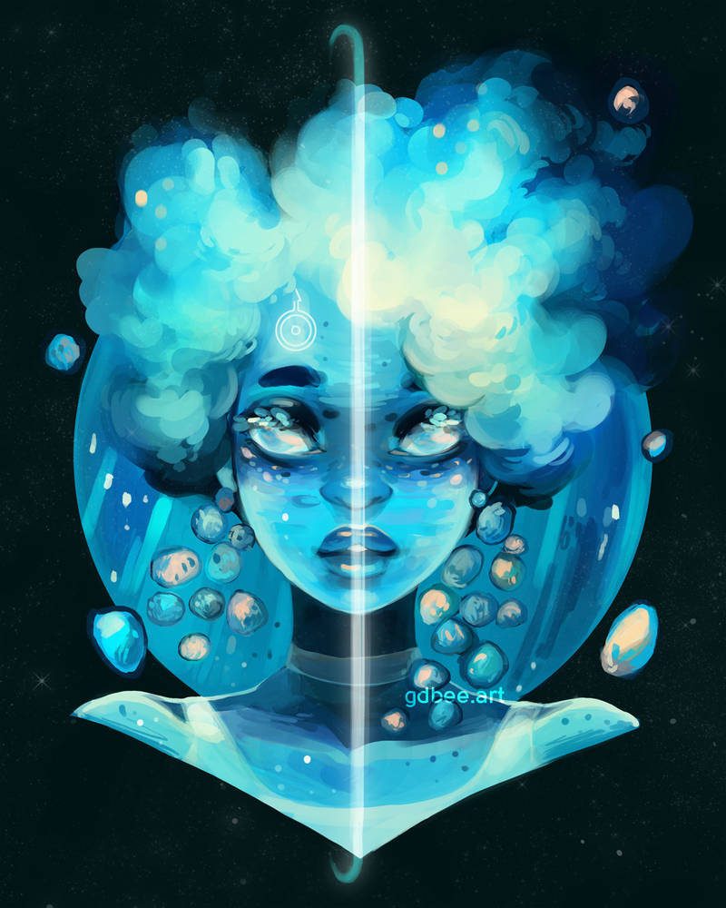

---
tags:
  - setting/substrate-saga
  - story/trapped-god
  - world-building/character
---
# Ariadne / Aria

A mysterious entity that helps guide [[Micah Warren]] through the [[Floating Archipelago]].

Is she Thonic? Or something else entirely?

##### Motivation
Help out [[Micah Warren]] to get to the center and discover what's there.
Potentially nefarious reasons, take the power for herself? Or maybe to release the Thonics from the metaphorical chains of their religion.

##### Visual Design
Light, white hooded robes that change color/pattern, seemingly at her whim.
Consistently listening to something on a walkman.
Short, light-colored hair.

[][uranussrc]
[Source: gdbee][uranussrc]

---
[[Trapped God]]
[[Substrate Saga Hub]]

[uranussrc]:https://www.genevab.com/planettes#uranus-7030