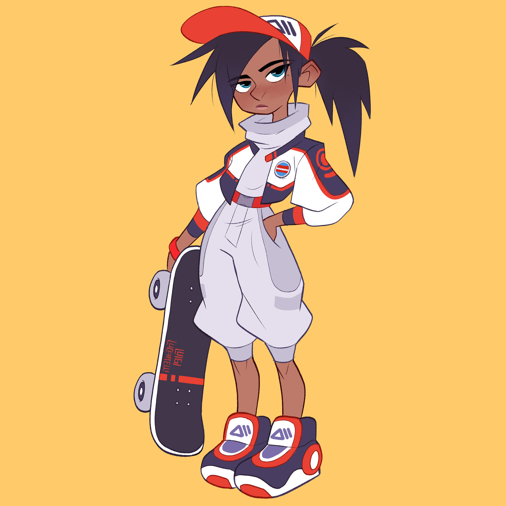
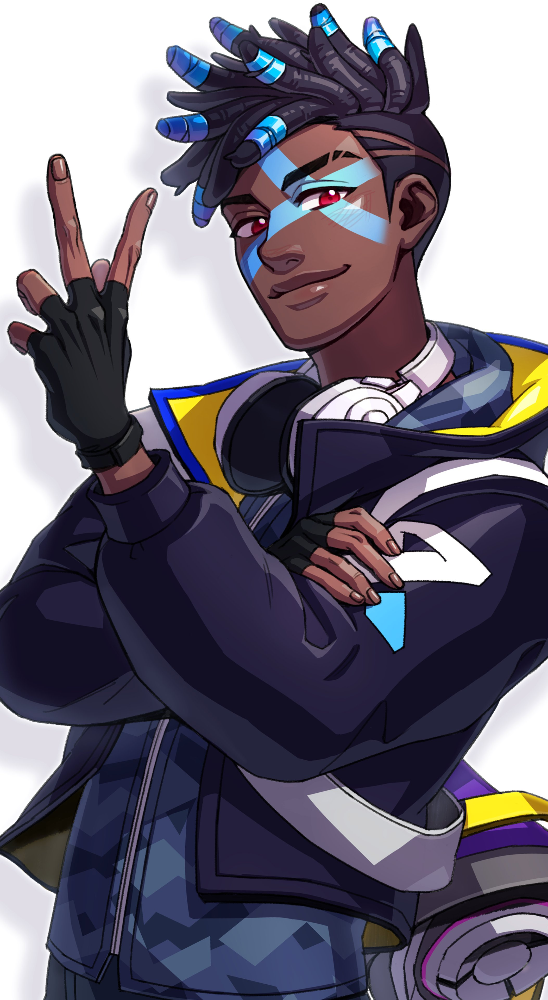

---
tags:
  - setting/substrate-saga
  - story/trapped-god
  - world-building/character
---
# Micah Warren

Human kid, suddenly found themselves in the [[Floating Archipelago]], with an urge to get to the center of the city.

##### Motivation
Discover what is drawing them to the center of the city, potentially finding a way home.

##### Visual Design
- Human, Skater kid. You look at them and you get a distinct "no thoughts head empty" vibe, maybe. But they are full of thoughts. Brain too full.

Outfits:
[][sk8grlsrc]
[Source: Luigi Lucarelli on Artstation][sk8grlsrc]

[][ekkosrc]
[Source: @LOLdayo on Twitter][ekkosrc]

##### Abilities
- Able to interact with various crystals to tether to (i.e. grapple beam) (this is more game-y than story-y)
- Innate connection with the cosmic energy flowing through the [[Floating Archipelago]].

---
[[Trapped God]]
[[Substrate Saga Hub]]

[ekkosrc]:https://twitter.com/LOLdayo/status/1301223861644476417
[sk8grlsrc]:https://www.artstation.com/artwork/1nd3Jo