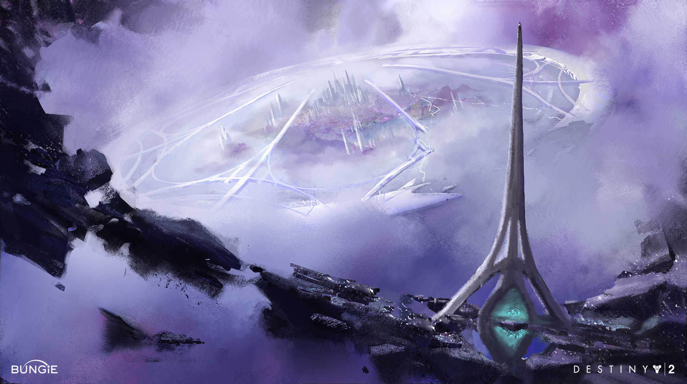

---
tags:
  - setting/substrate-saga
  - story/trapped-god
  - world-building/location
--- 

# Themis

A Ruin deep in the center of the largest asteroid of the [[Floating Archipelago]].

Main city is centered on the worship of energy emanating from the center of a central asteroid. Architecture is very cathedral-like (i.e. Dreaming City).

## Name

From the titan [Themis][namesource]: "She was the human-like representation of the natural and moral order"

[][dcimgsource]
Source (and more images): [Dorje Bellbrook - artstation.com][dcimgsource]

---
[[Trapped God]]
[[Substrate Saga Hub]]

[namesource]: https://www.greekmythology.com/Titans/Themis/themis.html
[dcimgsource]:https://www.artstation.com/artwork/v11X03